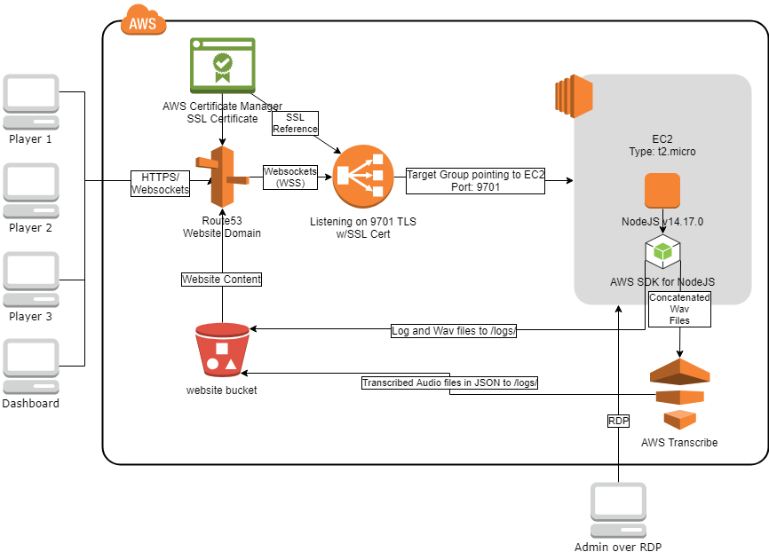

# Libra-Audio

Libra Audio is a 3-person push-to-talk audio communication app that is designed to run on AWS, though with a bit of work you should be able to run it on just about anything.

The client is run from a website hosted on an S3 bucket with SSL. The client will connect to the server, and communicate with the other users by transmitting chunks of audio while the talk button is pressed. 

The server is a NodeJS server on an EC2 instance sitting behind a Network Load Balancer. As the server files themselves are stored here, below is a list of specs for the NodeJS server being used:

Version: 14.17.0
Start From: main.js
NPM installs needed:
	websocket
	@aws-sdk/client-s3
	@aws-sdk/client-transcribe
	
In addition, in the server folder, there is a file named wsConfig.json which holds the configuration options allowing for connection and working with AWS services, as well as general websocket server configuration. That needs to be configured in order for the server to run properly. The server can run on an AWS t2.micro, but there are no present stats on how many instances can be handled before scaling is needed, and no scaling code is provided in this repo. If you do want to scale, it should be relatively simple to write a server that directs users to specific EC2/NodeJS instances that currently handle the room codes entered, and send the client the wss url for that server.

On the backend, the server will send the clients' audio chunks to AWS Transcribe to be transcribed, and the resulting json transcriptions, as well as the raw wav and telemetry txt files, are stored in a /logs/ folder in the bucket.

A dashboard tool is also made available which would sit on the website in a /dashboard/ folder, to be accessed and used by teachers/supervisors. The dashboard will allow for monitoring of speaking statistics, but not for access to the audio streams or content.

Both the client and the dashboard tool uses Phaser (Phaser.io) v3.21.0.

To keep the server alive, we're using .